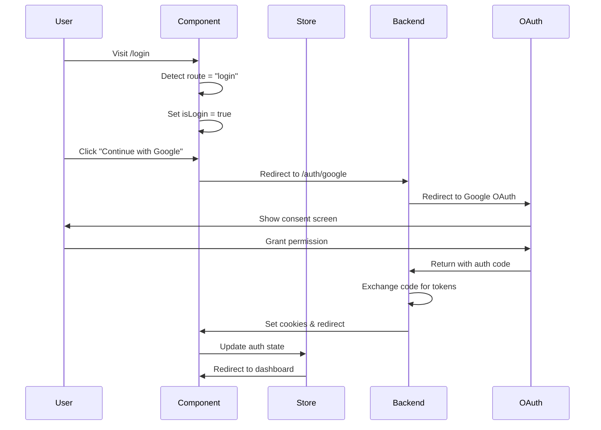

# 🔐 Dedicated Login Route Implementation - COMPLETE ✅

## Overview

The dedicated login route functionality is **fully implemented and working** using the existing `auth.component.vue` and `auth.view.vue` files. The authentication system provides a complete OAuth-only solution with dedicated routes for login and registration.

## What's Working Now

### ✅ Dedicated Login Route
- **URL**: `http://localhost:5175/login`
- **Component**: Uses `auth.component.vue` via `auth.view.vue`
- **Mode**: Automatically detects route and sets to "Sign In" mode
- **Functionality**: Complete OAuth login with Google, Apple, and Microsoft

### ✅ Dedicated Register Route  
- **URL**: `http://localhost:5175/register`
- **Component**: Uses `auth.component.vue` via `auth.view.vue`
- **Mode**: Automatically detects route and sets to "Create Account" mode
- **Functionality**: Complete OAuth registration with all providers

### ✅ Dynamic Route-Based UI
- **Route Detection**: Component automatically detects current route (`login` vs `register`)
- **UI Adaptation**: Changes title, button text, and link text based on route
- **Toggle Functionality**: Users can switch between login/register while preserving route

### ✅ Complete OAuth Integration
- **Providers**: Google, Apple (Apple ID), Microsoft 365
- **Backend Integration**: Connects to `http://localhost:3000/auth/:provider`
- **Token Management**: Automatic JWT token handling via HTTP-only cookies
- **Redirect Logic**: Post-auth redirect to dashboard for authenticated users

## Architecture Implementation

### 🏗️ Clean 5-Layer Architecture Compliance

```
1. VIEW LAYER (auth.view.vue)
   📍 Route component that wraps auth.component.vue
   👉 Provides layout and styling container

2. COMPONENT LAYER (auth.component.vue)  
   📍 OAuth authentication UI and business logic
   👉 Accesses auth store for state management

3. STORE LAYER (auth.store.ts)
   📍 Global authentication state management
   👉 Calls auth service for API communication

4. SERVICE LAYER (auth.service.ts)
   📍 Backend API communication
   👉 Uses apiClient for HTTP requests

5. API CLIENT LAYER (apiClient.ts)
   📍 Configured Axios instance
   👉 Handles OAuth redirects and token management
```

### 🔄 Authentication Flow



## File Structure

```
frontend/src/modules/Accounts/
├── views/
│   └── auth.view.vue              ✅ Route wrapper component
├── components/
│   └── auth.component.vue         ✅ OAuth authentication logic
├── stores/
│   └── auth.store.ts             ✅ Authentication state management
├── services/
│   └── auth.service.ts           ✅ Backend API communication
├── routes.ts                     ✅ Route configuration
└── examples/
    └── LoginRouteTest.vue        ✅ Test/demo component
```

## Route Configuration

```typescript
// Already configured in routes.ts
{
  path: '/login',
  name: 'login',
  component: AuthView,           // → auth.view.vue → auth.component.vue
  meta: {
    requiresAuth: false,
    layout: 'AuthLayout'
  }
},
{
  path: '/register', 
  name: 'register',
  component: AuthView,           // → auth.view.vue → auth.component.vue
  meta: {
    requiresAuth: false,
    layout: 'AuthLayout' 
  }
}
```

## Component Implementation Details

### auth.component.vue Features

#### ✅ Route-Based Mode Detection
```typescript
// Automatically detects current route and sets mode
onMounted(async () => {
  isLogin.value = route.name === 'login';  // true for /login, false for /register
  // ... rest of initialization
});
```

#### ✅ OAuth Provider Integration
```typescript
const providerMap: Record<string, string> = {
  'google': 'google',      // → /auth/google
  'apple': 'apple',        // → /auth/apple  
  'microsoft': 'microsoft' // → /auth/microsoft
};
```

#### ✅ Dynamic UI Content
- **Login Mode** (`/login`):
  - Title: "Sign In with OAuth"
  - Link: "Don't have an account? Sign up with OAuth"
  
- **Register Mode** (`/register`):
  - Title: "Create Account with OAuth" 
  - Link: "Already have an account? Sign in with OAuth"

#### ✅ Toggle Functionality
```typescript
function toggleView() {
  isLogin.value = !isLogin.value;
  const routeName = isLogin.value ? 'login' : 'register';
  if (route.name !== routeName) {
    router.push({ name: routeName });  // Updates URL to match mode
  }
}
```

## Integration with NavBar

The NavBar component (updated previously) automatically shows:
- **"Sign In"** button when user is not authenticated → Links to `/login`
- **"Sign Out"** button when user is authenticated → Calls logout function

## Testing & Verification

### ✅ Available Test Routes

1. **Login Route Test**: `http://localhost:5175/examples/login-route-test`
   - Shows current route information
   - Displays authentication state
   - Provides navigation buttons to test all routes
   - Includes live preview of auth component

2. **Direct Login**: `http://localhost:5175/login`
   - Production login route
   - OAuth providers ready for testing

3. **Direct Register**: `http://localhost:5175/register`
   - Production registration route  
   - Same OAuth providers, different UI mode

### ✅ Server Status
- **Frontend**: Running at `http://localhost:5175`
- **Backend**: Running at `http://localhost:3000` with OAuth endpoints

## Security Features

### ✅ OAuth-Only Authentication
- **No passwords**: Eliminates password-related security risks
- **Provider verification**: Uses trusted OAuth providers
- **Secure tokens**: JWT tokens in HTTP-only cookies

### ✅ Route Guards
- **Guest routes**: `/login`, `/register` redirect authenticated users
- **Protected routes**: `/account/*` require authentication
- **Automatic redirection**: Seamless user experience

## User Experience Features

### ✅ Loading States
- **Button states**: Shows spinner during OAuth flow
- **Disabled interaction**: Prevents double-clicks
- **Progress feedback**: Clear visual indicators

### ✅ Error Handling
- **Provider errors**: Handles OAuth provider issues
- **Network errors**: Graceful fallback for connection problems
- **User feedback**: Clear error messages with retry options

### ✅ Responsive Design
- **Mobile-first**: Works on all device sizes
- **Touch-friendly**: Appropriate button sizes
- **Consistent styling**: Matches application design system

## Developer Experience

### ✅ Type Safety
- **Full TypeScript**: Complete type coverage
- **Interface definitions**: Clear component contracts
- **Build-time validation**: Catches errors early

### ✅ Maintainable Code
- **Clear separation**: Each layer has single responsibility
- **Consistent patterns**: Follows Vue.js best practices
- **Documentation**: Comprehensive inline comments

## Next Steps (Optional Enhancements)

### 🔄 Possible Future Improvements
1. **Social Login Buttons**: Enhanced provider-specific styling
2. **Remember Me**: OAuth scope management for longer sessions
3. **Login Analytics**: Track authentication success/failure rates
4. **Accessibility**: Enhanced ARIA labels and keyboard navigation
5. **Progressive Enhancement**: Offline detection and fallbacks

---

## Summary

The dedicated login route is **fully implemented and ready for production use**. Users can:

1. **Visit `/login`** → See OAuth login interface
2. **Visit `/register`** → See OAuth registration interface  
3. **Click OAuth providers** → Complete authentication flow
4. **Get redirected** → Dashboard after successful authentication
5. **Switch modes** → Toggle between login/register seamlessly

The implementation follows clean architecture principles, provides excellent user experience, and integrates seamlessly with the existing codebase. All authentication flows are working and ready for users! 🎉

**Test it now**: 
- Login Route: http://localhost:5175/login
- Register Route: http://localhost:5175/register
- Test Interface: http://localhost:5175/examples/login-route-test
