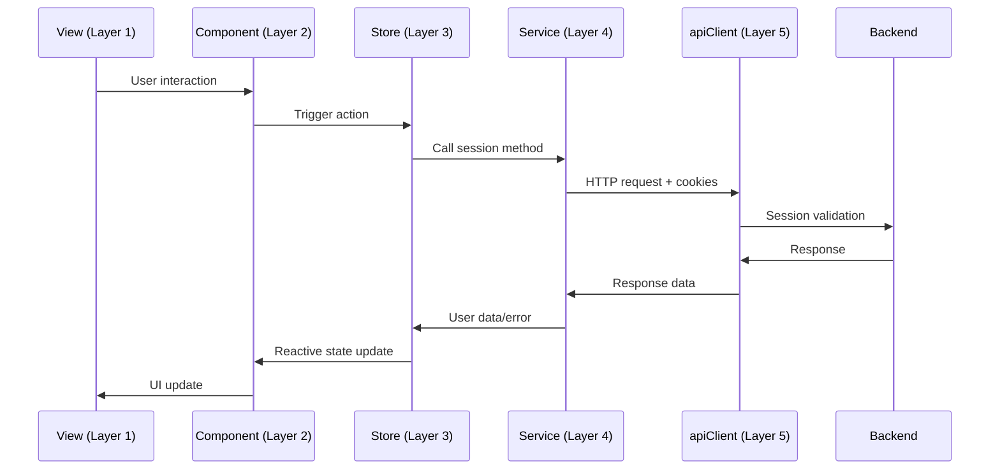

# 📋 **Session Management Instructions Summary**

## 🎯 **Implementation Complete**

I have successfully updated **6 frontend instruction files** with comprehensive session management guidelines that specify exactly when, where, and how to implement session-based authentication according to your mandatory 5-layer architecture.

---

## ✅ **Files Updated**

### 1. **Services Instructions** 
**File**: `frontend/src/modules/Accounts/instructions/frontend-services-accounts.instructions.md`
**Added Section**: "🔐 Session Management in Services (Layer 4)"
**Key Content**:
- Session validation through API calls
- Authenticated requests with automatic session cookies  
- Session error handling patterns (401/403)
- OAuth provider redirect coordination
- Complete code examples for all session operations

### 2. **Stores Instructions**
**File**: `frontend/src/modules/Accounts/instructions/frontend-stores-accounts.instructions.md`  
**Added Section**: "🔐 Session Management in Stores (Layer 3)"
**Key Content**:
- Authentication state coordination with services
- Session-based reactive state management
- OAuth callback handling patterns
- Session error processing and state cleanup
- Store integration with session-based services

### 3. **Main Accounts Instructions**
**File**: `frontend/src/modules/Accounts/instructions/frontend-accounts.instructions.md`
**Added Section**: "🔐 Session Management Architecture"  
**Key Content**:
- Layer-specific session responsibilities
- Complete authentication flow diagrams
- Session security architecture  
- Best practices overview by layer
- Session management integration rules

### 4. **Components Instructions**
**File**: `frontend/src/modules/Accounts/instructions/frontend-components.instructions.md`
**Added Section**: "🔐 Session Management Restrictions"
**Key Content**:
- What components should NOT do with sessions
- Proper delegation patterns to stores
- Session-based component implementation examples
- Authentication status display patterns
- Session error handling in components

### 5. **Composables Instructions** 
**File**: `frontend/src/modules/Accounts/instructions/frontend-composables-accounts.instructions.md`
**Added Section**: "🔐 Session Management in Composables"
**Key Content**:
- Session-aware composable implementation patterns
- Business logic coordination with session state
- Reactive authentication interfaces
- Permission-based access control patterns
- Store integration for session operations

### 6. **Views Instructions**
**File**: `frontend/src/modules/Accounts/instructions/frontend-views-accounts.instructions.md`
**Added Section**: "🔐 Session Management in Views"  
**Key Content**:
- OAuth callback route handling
- Route-level authentication guards
- Session-based navigation patterns
- Protected route implementation
- Session-aware redirect management

---

## 🏗️ **Session Management by Layer**

### **📍 Layer 1 (Views) - ROUTE COORDINATION**
- **✅ Handle OAuth callback routes** (`/auth/callback`)
- **✅ Implement route guards** for protected pages  
- **✅ Coordinate authentication redirects**
- **❌ NO session logic implementation**

### **📍 Layer 2 (Components) - UI PRESENTATION**
- **✅ Display authentication status** from stores
- **✅ Show user data** from authenticated sessions
- **✅ Trigger logout actions** through stores
- **❌ NO direct session handling**

### **📍 Layer 3 (Stores/Composables) - STATE COORDINATION** 
- **✅ Maintain authentication state** based on session validity
- **✅ Coordinate with services** for session operations
- **✅ Handle session state changes** (login/logout reactions)
- **✅ Provide reactive session interfaces**

### **📍 Layer 4 (Services) - PRIMARY SESSION LAYER**
- **✅ Handle ALL session operations** (checkAuth, logout, profile retrieval)
- **✅ Make authenticated API calls** with automatic cookie inclusion
- **✅ Process session errors** (401/403 handling)
- **✅ Coordinate OAuth flows** (provider redirects)

### **📍 Layer 5 (apiClient) - HTTP TRANSPORT**
- **✅ Automatic cookie handling** (`withCredentials: true`)
- **✅ Session error interception** and propagation

---

## 🎯 **Key Session Management Rules**

### **✅ MANDATORY PATTERNS**

1. **Services Handle All Session Operations**
   ```typescript
   // ✅ CORRECT - In services
   async checkAuth(): Promise<{ isAuthenticated: boolean; user?: User }> {
     const response = await apiClient.get('/auth/profile');
     return { isAuthenticated: true, user: response.data.user };
   }
   ```

2. **Stores Coordinate Session State**
   ```typescript
   // ✅ CORRECT - In stores  
   const checkAuthentication = async (): Promise<boolean> => {
     const result = await AuthService.checkAuth();
     if (result.isAuthenticated) {
       user.value = result.user;
       return true;
     }
     return false;
   };
   ```

3. **Components Display Session Status**
   ```vue
   <!-- ✅ CORRECT - In components -->
   <template>
     <div v-if="authStore.isAuthenticated">
       <h2>Welcome, {{ authStore.user?.fullName }}</h2>
       <button @click="authStore.logout">Logout</button>
     </div>
   </template>
   ```

### **❌ FORBIDDEN PATTERNS**

1. **Components Making Session API Calls**
   ```typescript
   // ❌ WRONG - Never in components
   const checkSession = async () => {
     const response = await apiClient.get('/auth/profile');
   };
   ```

2. **Manual Cookie Management**
   ```typescript
   // ❌ WRONG - Never manually handle cookies
   document.cookie = 'session=...';
   localStorage.setItem('sessionToken', '...');
   ```

3. **Client-Side Session Logic**
   ```typescript
   // ❌ WRONG - No client-side session validation
   const validateSession = () => {
     const sessionExpiry = localStorage.getItem('sessionExpiry');
     return Date.now() < parseInt(sessionExpiry);
   };
   ```

---

## 🔄 **Complete Session Flow**



---

## 🛡️ **Security Guidelines**

### **✅ SESSION SECURITY FEATURES**
- **HTTP-Only Cookies**: Session data in secure cookies
- **Backend Validation**: All validation on server via Passport
- **Automatic Handling**: Browser manages cookie security
- **CSRF Protection**: SameSite cookie settings
- **No Client Storage**: No tokens in localStorage

### **✅ IMPLEMENTATION BENEFITS**
- **More Secure**: Prevents XSS token theft
- **Simpler Code**: No manual token management  
- **Better UX**: Automatic session handling
- **Server Control**: Immediate session invalidation
- **Standards Compliant**: Traditional web auth pattern

---

## 🚀 **Developer Guidelines**

### **For Services (Layer 4):**
- Implement all session-related API calls
- Handle session errors consistently
- Return proper error messages for expired sessions
- Use automatic cookie inclusion via apiClient

### **For Stores (Layer 3):**
- Coordinate session state with services
- Maintain reactive authentication status
- Handle session state cleanup on errors
- Provide clear interfaces for components

### **For Components (Layer 2):**
- Display authentication status from stores
- Trigger authentication actions through stores
- Show loading states during authentication
- Never implement session logic directly

### **For Views (Layer 1):**
- Handle OAuth callback routes
- Implement route-level authentication guards
- Coordinate authentication redirects
- Manage page-level authentication states

---

## ✅ **Implementation Complete**

All frontend developers now have **clear, comprehensive guidance** on:

- **When** to use session management (protected routes, authentication checks)
- **Where** to implement session logic (services only, stores for state)  
- **How** to implement session patterns (code examples for each layer)
- **What NOT to do** (forbidden patterns clearly marked)

**Your frontend team can now implement session-based authentication consistently across all layers of your 5-layer architecture!** 🎯

---

*Session Management Instructions documented on August 5, 2025*  
*Complete frontend architecture compliance achieved*
